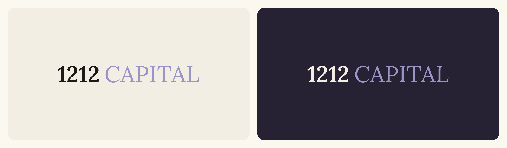
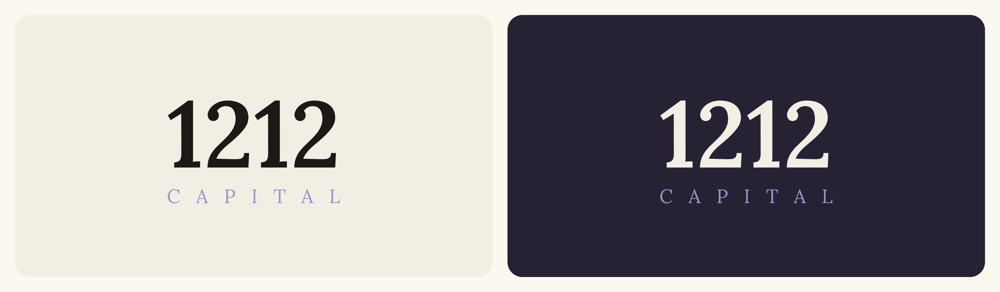
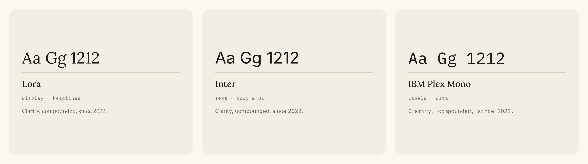
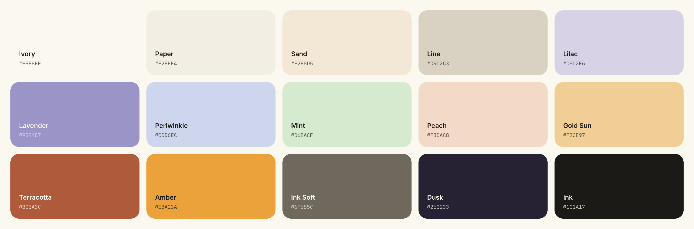
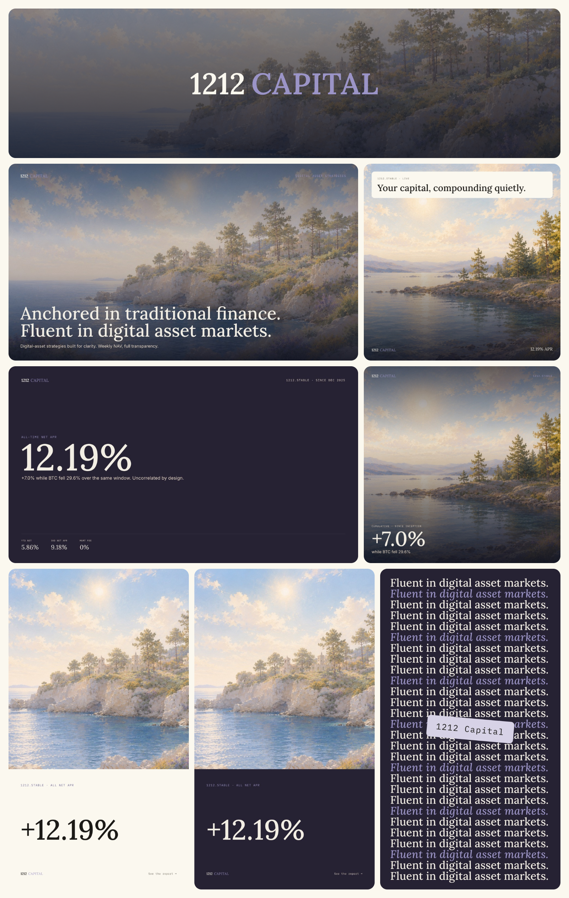

# 1212 Capital Brand Kit

This repository contains the brand assets and design system for 1212 Capital. The brand kit includes the elements that keep every 1212 Capital product, document and marketing material consistent.

## Contents

Browse it on the brand site: https://brand.1212.capital

| Folder | What's in it |
|---|---|
| `Logos/` | The logotype: horizontal, symbol, and reversed for dark backgrounds (SVG and PNG), square lockups and avatars (PNG) |
| `Banners/` | Profile and company banners for LinkedIn and X, at each platform's native size (PNG) |
| `Illustrations/` | The painted landscapes: Dawn, Noon and Dusk, six each at full resolution (PNG), and web-sized copies of all 18 in `Web/` (JPG) |
| `Templates/` | Social canvases: announcement, editorial, performance, repeat, split, stat and story, in 16:9, 1:1 and 9:16 (PNG) |
| `Documents/` | Reference PDFs: a client statement, a fact sheet, an internal document and a newsletter |
| `Brand/Fonts/` | The three typefaces, Lora, Inter and IBM Plex Mono (WOFF2), with their licence |
| `scripts/` | `logo-svg.py`, which outlines the logotype to SVG from the Lora font |

The colour palette and the typography rules are in [GUIDELINES.md](GUIDELINES.md), with
the detailed usage rules for everything above.

`1212 Brand Assets.zip` holds the full-resolution masters in one download.

All brand assets and design elements are proprietary and owned by 1212 Capital Inc. Unauthorized use or distribution is prohibited.

